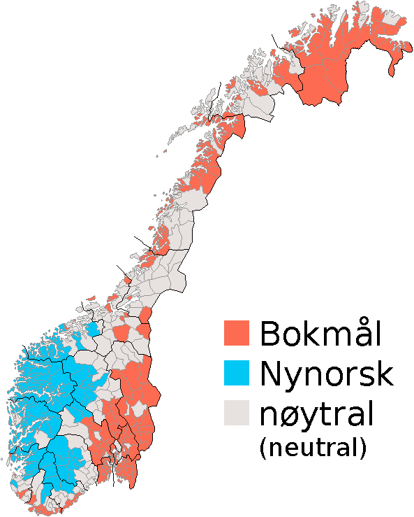

# L1 · *Hei!* Saludar, presentarte y dominar las letras que asustan
**Tiempo estimado: 30 minutos**

Bienvenido a la primera lección del curso. Antes de meterte en mitología, fiordos o pedir un café en Bergen, lo primero es **saber decir tu nombre y reconocer el sonido del noruego**. Suena obvio, pero ahí está la mitad de la batalla: si las letras æ, ø, å dejan de darte miedo, todo lo demás llega rodado.

En esta lección vas a entender por qué el noruego se parece tanto al inglés que ya sabes, cómo se saluda según la hora del día, qué hacen esas tres letras raras del final del alfabeto y cómo presentarte a alguien sin sonar como un robot.

Al terminar esta lección, serás capaz de:

- **Saludar** en noruego según el contexto y la hora del día (informal y formal).
- **Reconocer y pronunciar** las tres letras especiales del alfabeto noruego: æ, ø, å.
- **Presentarte**: decir tu nombre, edad y de dónde vienes.
- **Preguntar** a otra persona su nombre, edad y procedencia.
- **Identificar cognados** entre noruego e inglés que te ayudarán durante todo el curso.

Esta lección tiene cinco actividades:

- 📖 Lectura guiada: el alfabeto y los saludos (10 min)
- 🎮 Visual novel: *Første dag på skolen* — primer día de clase (12 min)
- 🧩 Empareja saludos con situaciones (4 min)
- ✏️ Mini-ejercicios de autocorrección (4 min)
- 💭 Reflexión final: el atajo germánico (4 min)

Hazlas en orden. ¿Listo? 
*Vi setter i gang!* 
(¡Empezamos!)

---

## 📖 El noruego de bienvenida: alfabeto y saludos
**Tiempo de lectura: 10 minutos**

### Antes de leer

Piensa un momento: si alguien te dice «Hola» en español por la calle, ¿esperas la misma respuesta a las 8 de la mañana que a las 11 de la noche? En español, "hola" vale para todo. En noruego, **la hora del día sí cambia el saludo en contextos un poco más formales**, igual que pasa en inglés con *good morning* / *good evening*.

Esa es la primera regla que tienes que interiorizar.

### Qué es el bokmål y por qué lo estás aprendiendo

En Noruega no hay una sola forma escrita del idioma: hay dos. **Bokmål** ("lengua del libro") es la que usa el 85% de la población, la de los medios, la de los manuales escolares y la que se enseña a los extranjeros. La otra se llama **nynorsk** y se usa más en zonas rurales del oeste del país. En este curso aprenderás bokmål, que es lo que necesitas para entender prácticamente cualquier cosa en Noruega.

> 💡 **El primer atajo germánico:** *bok* significa "libro" en noruego. ¿A qué se parece en inglés? Exacto: *book*. Y *mål* significa "lengua, idioma". El noruego y el inglés son lenguas primas y vas a ver decenas de palabras como esta a lo largo del curso. Acostúmbrate a buscar la conexión con el inglés que ya sabes.

### El alfabeto noruego: 29 letras, no 26

El alfabeto noruego tiene **las mismas 26 letras que el inglés más tres letras adicionales** que aparecen al final, después de la Z: **æ, ø, å**. Es importante saber que estas no son "letras decoradas" como la ñ española: son letras independientes, con su propio sitio en el alfabeto y su propio sonido.

| Letra | Sonido aproximado | Ejemplo noruego | Significado | 🔊 Escuchar |
|-------|-------------------|-----------------|-------------|-------------|
| **Æ æ** | Como la "a" de la palabra inglesa *cat*, abierta | *bær* | bayas | [Forvo: bær](https://forvo.com/word/b%C3%A6r/#no) |
| **Ø ø** | Como la "u" de la palabra inglesa *burn* | *søster* | hermana | [Forvo: søster](https://forvo.com/word/s%C3%B8ster/#no) |
| **Å å** | Como la "o" de la palabra inglesa *born* | *gå* | ir, caminar | [Forvo: gå](https://forvo.com/word/g%C3%A5/#no) |

> 🔊 **Cómo usar los audios**: haz clic en el enlace, te lleva a Forvo (un diccionario libre de pronunciaciones grabadas por hablantes nativos). **Escucha cada palabra al menos dos veces** antes de pasar a la siguiente. No intentes imitarla todavía, solo familiarízate con el sonido.

> ⚠️ **Aviso importante**: en este curso vas a usar el noruego como se habla en el este (Oslo y alrededores), que es la variedad que se enseña a los extranjeros y se considera estándar. Hay muchos dialectos en Noruega y pueden sonar bastante diferentes, pero entender bien la variedad de Oslo te permite seguir cualquier conversación.

### Saludar: dos registros, varias horas

Como pasa en inglés con *hi* / *good morning* / *good evening*, en noruego hay un saludo todo-terreno y otros más específicos según el momento del día.

**El saludo universal:**

- ***Hei*** — "Hola". Es el saludo más usado en el día a día. Sirve para amigos, desconocidos en la calle, dependientes en una tienda y profesores en el instituto. Suena como el inglés *hey*.
- ***Hallo*** — Ligeramente más formal que *hei*. Es lo que se dice al contestar el teléfono.

**Saludos según la hora del día (un poco más formales):**

- ***God morgen*** — Buenos días (hasta media mañana, sobre las 10:00-11:00)
- ***God dag*** — Buenos días / Buenas tardes (de media mañana a primera tarde)
- ***God ettermiddag*** — Buenas tardes (del mediodía hasta primeras horas de la noche)
- ***God kveld*** — Buenas noches, al saludar (a partir del atardecer)
- ***God natt*** — Buenas noches, al despedirse antes de dormir

**Despedidas:**

- ***Ha det*** o ***Ha det bra*** — Adiós, cuídate (lo más común, informal y formal)
- ***Vi sees*** — Nos vemos (entre amigos)
- ***Farvel*** — Adiós (formal, casi anticuado)

> 💡 **Truco cultural**: Noruega es uno de los países menos jerárquicos del mundo. Incluso en una reunión de trabajo o en una entrevista, un simple *hei* es perfectamente aceptable. No te vuelvas loco con la formalidad: para empezar te basta con *hei* y *ha det*.

### Presentarte: cuatro frases que te abren la puerta

Estas son las cuatro frases que vas a necesitar en cuanto cruces una palabra con un noruego. Apréndetelas como una unidad: **funcionan siempre, sin importar la edad o el contexto**.

| Para decir... | En noruego |
|---------------|------------|
| Hola, me llamo Sara. | *Hei, jeg heter Sara.* |
| Tengo 16 años. | *Jeg er 16 år gammel.* (o más corto: *Jeg er 16.*) |
| Vengo de España. | *Jeg kommer fra Spania.* |
| Encantado/a de conocerte. | *Hyggelig å møte deg.* |

Y para preguntar lo mismo a otra persona:

| Para preguntar... | En noruego |
|-------------------|------------|
| ¿Cómo te llamas? | *Hva heter du?* |
| ¿Cuántos años tienes? | *Hvor gammel er du?* |
| ¿De dónde eres? | *Hvor kommer du fra?* |
| ¿Cómo estás? | *Hvordan går det?* (respuesta típica: *Bra* — "bien") |

> 💡 **Cazando cognados germánicos:** mira *Jeg er 16 år gammel*. Si la lees en voz alta, ¿no se parece sospechosamente a *I am 16 years (old)*? *Jeg = I*, *er = am*, *år = year*, *gammel = old*. El orden incluso es el mismo.

### Mientras lees, fija tres ideas

1. **Hei sirve para casi todo**. No te agobies con la formalidad: en el día a día, el 90% de los saludos son *hei*.
2. **Las letras æ, ø, å son letras de pleno derecho**, no decoraciones. Aparecen en palabras tan básicas como *år* (año), *gå* (ir), *søster* (hermana) o *være* (ser). Acostúmbrate a verlas y a pronunciarlas.
3. **El inglés es tu copiloto**. Cada vez que veas una palabra noruega nueva, busca primero si se parece a alguna palabra inglesa. La mitad de las veces, la respuesta es que sí.

---

## 🎮 *Første dag på skolen* — Visual novel
**Tiempo estimado: 12 minutos**

Ahora que ya sabes los saludos y cómo presentarte, vas a ponerlos en práctica en una situación real: tu primer día en un instituto de Oslo.

### El escenario

Eres **un/a estudiante de intercambio** que acaba de aterrizar en Oslo para pasar un curso en un instituto noruego. Es lunes por la mañana, no conoces a nadie y acabas de entrar en clase. Una chica llamada **Sara** y un chico llamado **Jonas** se acercan a hablar contigo. Lo que digas (y cómo lo digas) decide cómo va a empezar tu curso allí.

### Instrucciones

Lee cada diálogo y **elige tu respuesta** entre las opciones que aparecen. Algunas respuestas son neutras, otras son más naturales, y alguna te puede hacer pasar un mal rato. **No pasa nada**: puedes volver atrás y probar otra opción tantas veces como quieras. La actividad no se evalúa: el objetivo es que te sueltes con frases reales.

### Antes de hacer clic en "Empezar"

Mientras juegas, fíjate en tres cosas:

- **Cuándo Sara y Jonas usan *hei* y cuándo usan *god morgen*** (¿coincide con la hora del día?).
- **Cómo se introduce información personal poco a poco** (no se dice todo de golpe en la primera frase).
- **Qué pasa si eliges la opción "formal" con personas de tu edad** (pista: queda raro, igual que en español).

➡️ **Abrir la visual novel:** [Første dag på skolen](renpy-instituto/)

Cuando acabes, vuelve aquí para la siguiente actividad.

---

## 🧩 Empareja: ¿qué dirías en cada situación?
**Tiempo estimado: 4 minutos**

Ahora vamos a comprobar si has interiorizado **cuándo usar cada saludo**. Esto es importante porque, aunque *hei* sirva para casi todo, hay momentos en los que un *god kveld* o un *hyggelig å møte deg* marcan la diferencia.

### Instrucciones

Arrastra cada saludo o expresión a la situación que mejor le encaja. **Puedes repetir la actividad las veces que quieras**: no se guarda nota, solo te sirve para fijar lo aprendido.

> 🎯 **Si dudas**: pregúntate dos cosas. Primera: ¿es por la mañana, por la tarde o por la noche? Segunda: ¿estoy hablando con un amigo o con alguien que acabo de conocer? Con esas dos respuestas, aciertas el 90% de las veces.

### Ejemplo resuelto

**Situación:** *Son las 8:30 de la mañana, entras en una cafetería de Oslo y saludas al camarero.*

**Respuesta natural:** *Hei!* o, si quieres ser un poco más cortés, *God morgen!*

➡️ **Abrir la actividad de emparejamiento** *(se descargará como paquete SCORM importable a Moodle u otra plataforma compatible)*: [scorm-saludos.zip](scorm-saludos.zip)

---
### Ejercicio 4 — Detective de cognados
 
Mira estas seis palabras noruegas. **Cuatro de ellas tienen un cognado claro en inglés**. Identifica cuáles y escribe su pariente inglés al lado:
 
1. *hus* → ______________________
2. *jente* (chica) → ______________________
3. *sommer* → ______________________
4. *gutt* (chico) → ______________________
5. *vinter* → ______________________
6. *bok* → ______________________
---
 

<strong>🔎 Mostrar respuestas</strong> (haz clic para desplegar)

**Ejercicio 1:**
 
1. *Hei, jeg heter Marta.*
2. *Jeg kommer fra Spania.*
3. *Jeg er 15 år gammel.* (o *Jeg er 15.*)
4. *Hyggelig å møte deg.*
5. *Ha det, vi sees.* (o *Ha det bra!*)
**Ejercicio 2:** 1-c, 2-d, 3-a, 4-b.
 
**Ejercicio 3:**
 
1. *Hei* (informal, entre compañeros).
2. *God kveld* (es de noche, y entrar a un sitio justifica el saludo más completo). *Hei* también valdría, sería más casual.
3. *Hei* (en interacciones breves de comercio, *hei* es la norma).
4. *Hallo* (es lo que se dice por teléfono) o *Hei*.
**Ejercicio 4:** los cognados claros son **hus** (*house*), **sommer** (*summer*), **vinter** (*winter*) y **bok** (*book*). *Jente* y *gutt* no tienen cognado evidente en inglés actual.
 

> 💡 **Si has fallado más de la mitad de un ejercicio**: no pasa nada, vuelve a la lectura y repásalo. La idea no es aprobar nada, sino que detectes qué necesitas reforzar antes de pasar a la siguiente lección.
 
---

## 💭 Reflexión rápida: el atajo germánico
**Tiempo estimado: 4 minutos**

Cierra la lección con una vuelta al principio. Al empezar te dije esto:

> *"Si ya sabes inglés, llevas medio camino hecho."*

Ahora que has visto las primeras frases del noruego, vas a comprobarlo tú mismo.

### Instrucciones

Mira esta frase en noruego y compárala palabra por palabra con su traducción inglesa:

> 🇳🇴 ***Jeg er seksten år gammel og jeg kommer fra Spania.***
> 🇬🇧 *I am sixteen years old and I come from Spain.*

Cuenta cuántas palabras noruegas se parecen claramente a su equivalente inglesa. Después, escribe una respuesta corta (3-5 frases) contestando estas preguntas:

1. ¿Cuántas palabras has encontrado que se parezcan al inglés?
2. ¿Crees que esto te va a ayudar en las próximas lecciones? ¿Por qué?
3. ¿Qué te ha resultado más raro de esta primera lección (los sonidos de æ/ø/å, el orden de las palabras, las dos formas de escribir el idioma…)?

Esta actividad no se evalúa. Solo te sirve para **hacerte consciente** de un mecanismo que vas a explotar durante todo el curso: cada vez que aprendas una palabra nueva en noruego, párate un segundo a buscar su pariente en inglés. Es la herramienta más potente que tienes a tu disposición.

---

**Tiempo estimado: 4 minutos**
 
Cierra la lección con una vuelta al principio. Al empezar te dije esto:
 
> *"Si ya sabes inglés, llevas medio camino hecho."*
 
Ahora que has visto las primeras frases del noruego, vas a comprobarlo tú mismo.
 
### Instrucciones
 
Mira esta frase en noruego y compárala palabra por palabra con su traducción inglesa:
 
> 🇳🇴 ***Jeg er seksten år gammel og jeg kommer fra Spania.***
>
> 🇬🇧 *I am sixteen years old and I come from Spain.*
 
Cuenta cuántas palabras noruegas se parecen claramente a su equivalente inglesa. Después, escribe una respuesta corta (3-5 frases) contestando estas preguntas:
 
1. ¿Cuántas palabras has encontrado que se parezcan al inglés?
2. ¿Crees que esto te va a ayudar en las próximas lecciones? ¿Por qué?
3. ¿Qué te ha resultado más raro de esta primera lección (los sonidos de æ/ø/å, el orden de las palabras, las dos formas de escribir el idioma…)?
Esta actividad no se evalúa. Solo te sirve para **hacerte consciente** de un mecanismo que vas a explotar durante todo el curso: cada vez que aprendas una palabra nueva en noruego, párate un segundo a buscar su pariente en inglés. Es la herramienta más potente que tienes a tu disposición.
 
---
 
## Resumen de la lección
 
Si has llegado hasta aquí, ya sabes:
 
- ✅ Saludar en noruego según el contexto: *hei*, *god morgen*, *god kveld*, *ha det*.
- ✅ Reconocer las tres letras especiales del alfabeto noruego: **æ, ø, å**.
- ✅ Presentarte: nombre, edad, procedencia.
- ✅ Preguntar lo mismo a otra persona: *hva heter du?*, *hvor gammel er du?*, *hvor kommer du fra?*
- ✅ Detectar cognados germánicos para ahorrarte memorización.
En la próxima lección verás los **números, los días de la semana y los meses**, y entrarás de lleno en una fecha clave para entender Noruega: el ***17. mai***, el día nacional.
 
---
 
## Fuentes y créditos de esta lección
 
Contenido elaborado a partir de fuentes verificadas sobre la lengua noruega:
 
- Norwegian University of Science and Technology (NTNU). *NoW 1 — Pronunciation*. [ntnu.edu/now/1/pronunciation](https://www.ntnu.edu/now/1/pronunciation)
- Wikipedia. *Help:IPA/Norwegian*. Variante Urban East Norwegian. [en.wikipedia.org/wiki/Help:IPA/Norwegian](https://en.wikipedia.org/wiki/Help:IPA/Norwegian)
- Forvo. *Norwegian pronunciations* (audios bajo licencia CC). [forvo.com/languages/no](https://forvo.com/languages/no/)
- Cruttenden, A. (2014). *Gimson's pronunciation of English* (8.ª ed.). Routledge. (referencia comparativa)
Las equivalencias fonéticas con el inglés se ofrecen como aproximación didáctica para A0; no sustituyen la transcripción IPA completa, que se introducirá en niveles posteriores.