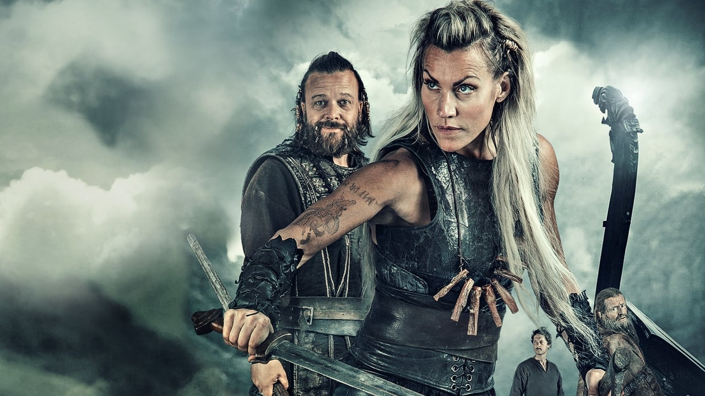
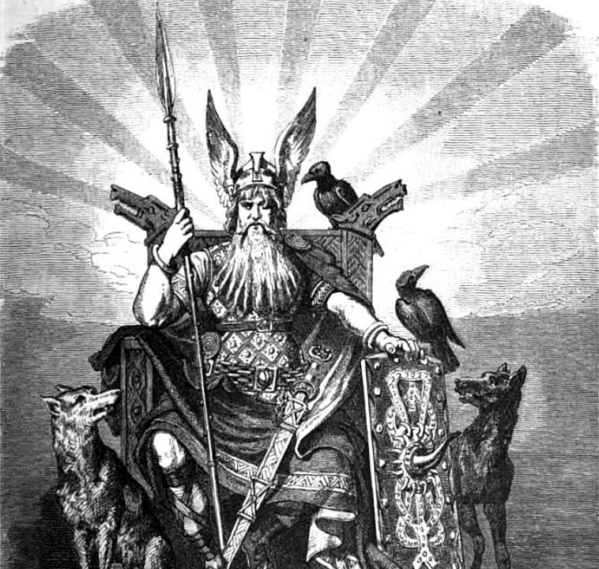
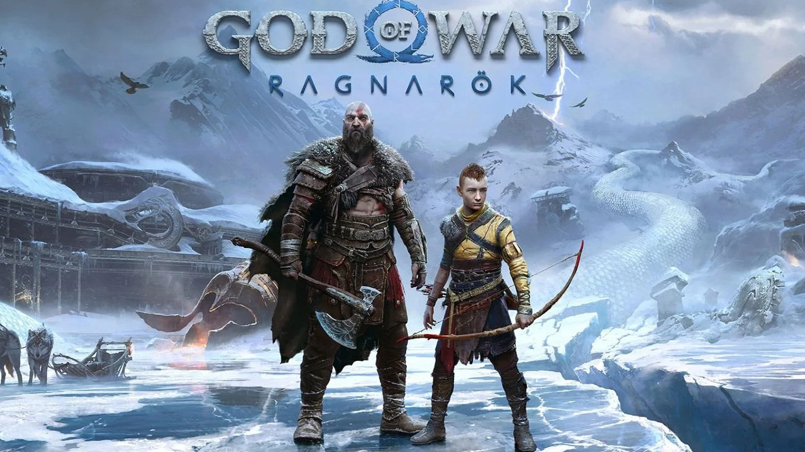
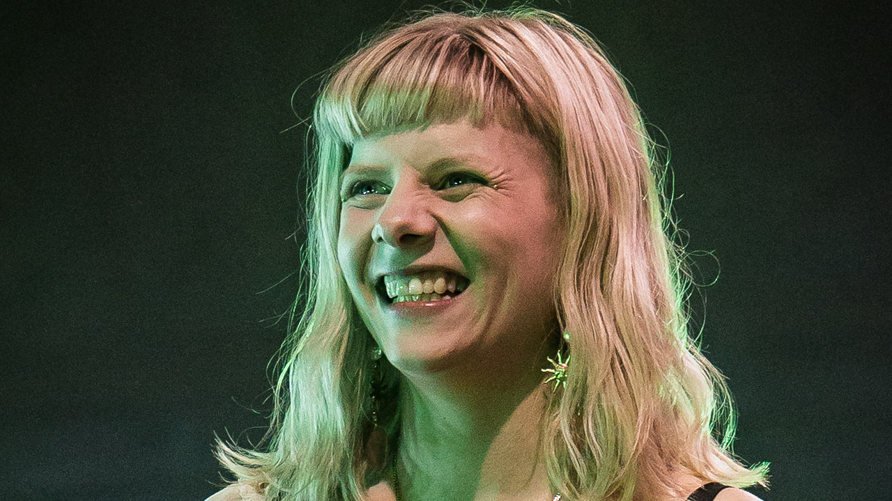
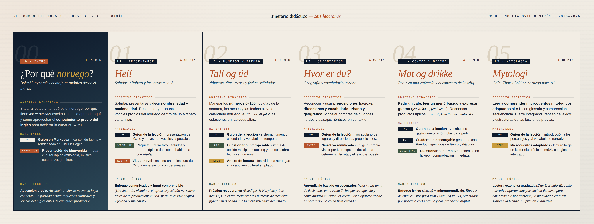

# Velkommen til Norge!

## Un curso de noruego desde cero a través de su cultura

El interés por el noruego entre el público hispanohablante ha crecido en los últimos años, impulsado por series como *Norsemen*, la mitología nórdica, los videojuegos como *God of War Ragnarök*, y la música de artistas como *Aurora*. Sin embargo, la oferta de cursos en español sigue siendo escasa y suele estar pensada para perfiles adultos con motivaciones académicas o laborales.

  
  
  
  

Este curso aborda ese vacío con un microcurso introductorio (A0 → A1) en bokmål, autoformativo y publicado como sitio web abierto, que utiliza la cultura nórdica como vehículo de la lengua.

## El atajo del inglés

El noruego y el inglés pertenecen a la misma familia germánica y comparten alrededor del 30-40 % del léxico básico. Comparándolo con el español, la distancia se ve claramente:

| Noruego | Inglés | Español |
|---------|--------|---------|
| Hus     | House  | Casa    |
| Bok     | Book   | Libro   |
| Vann    | Water  | Agua    |
| Gå      | Go     | Ir      |
| Komme   | Come   | Venir   |

Por eso este curso aprovecha el conocimiento previo del inglés y reduce significativamente el esfuerzo necesario para alcanzar un nivel A1 funcional.

## Objetivos de aprendizaje

En aproximadamente **3 horas repartidas en sesiones cortas**, el curso lleva del cero absoluto al **nivel A1 del MCER**. Al finalizar serás capaz de:

- **Reconocer** las letras especiales del noruego (æ, ø, å) y pronunciarlas correctamente.
- **Comprender** mensajes cortos, presentaciones personales, números, fechas, direcciones y vocabulario básico de comida y entorno.
- **Producir** expresiones cotidianas para identificarte, indicar tu procedencia, hablar de tus gustos y desenvolverte en situaciones como pedir en una cafetería o preguntar por una dirección.
- **Leer** microtextos adaptados sobre mitología nórdica y tradiciones noruegas con la ayuda de un glosario.
- **Identificar** los referentes culturales nórdicos presentes en series, música y videojuegos.

El curso no pretende formar hablantes fluidos, sino proporcionar una base sólida desde la cual continuar el aprendizaje de forma autónoma.

## Estructura del curso

El curso se compone de **seis bloques cortos** que se recomienda seguir en orden, ya que el vocabulario y las estructuras de cada lección se reutilizan en las siguientes.

### L0 · Introducción · 15 min
**¿Por qué noruego? Bokmål, nynorsk y el atajo germánico.**
Presentación del curso: qué es el noruego, por qué tiene dos variedades escritas, cuál se aprende aquí y cómo aprovechar el conocimiento previo del inglés.

### L1 · *Hei!* Presentarse · 30 min
**Saludos, alfabeto y las letras æ, ø, å.**
Saludar, presentarse, decir el nombre, la edad y la nacionalidad. Incluye una *visual novel* ambientada en un instituto de Oslo y un paquete interactivo descargable para practicar saludos y errores típicos.

### L2 · *Tall og tid* — Números y tiempo · 30 min
**Números, días, meses y fechas señaladas.**
Los números del 0 al 100, los días de la semana, los meses y las fechas más importantes del calendario noruego: el *17. mai*, el *jul* y las estaciones del año en latitudes altas.

### L3 · *Hvor er du?* — Lugares y orientación · 35 min
**Geografía y vocabulario urbano.**
Vocabulario de ciudades, paisajes y direcciones. Cierra con una narrativa interactiva tipo "elige tu propio viaje" en la que las decisiones del estudiante determinan la ruta y el vocabulario que se introduce.

### L4 · *Mat og drikke* — Comida y bebida · 30 min
**Pedir en una cafetería y el concepto de *koselig*.**
Pedir un café, leer un menú básico y reconocer productos típicos como el *brunost* o los *kanelboller*. Incluye un cuadernillo de ejercicios descargable y un cuestionario interactivo de comprobación.

### L5 · *Mytologi* — Mitología · 30 min
**Odín, Thor y Loki en noruego para A1.**
Lectura guiada de microcuentos mitológicos adaptados al nivel. La lectura final permite comprobar lo aprendido sobre contenido cultural.

## Materiales

Cada lección combina varios formatos para favorecer distintos estilos de aprendizaje:

- 📖 **Páginas web** con la explicación y los ejemplos de cada lección.
- 🎮 **Narrativas interactivas** en L1 (Ren'Py) y L3 (Twine), con decisiones ramificadas.
- 📚 **Anexos en formato EPUB** en L2 y L5, para lectura larga en dispositivos móviles.
- 📝 **Cuadernillo en PDF** en L4, descargable e imprimible.
- ✅ **Cuestionarios interactivos**: un cuestionario QTI en L2 y un quiz HTML integrado en L4.
- 🧩 **Paquete SCORM (H5P)** en L1, importable a entornos LMS como Moodle.
- 🎞️ **Presentación reveal.js** como introducción del curso (L0).

Todo el material está disponible de forma libre y gratuita.

## Antes de empezar

Tres consideraciones útiles antes de comenzar:

1. **El curso no expide certificación.** Se trata de un recurso educativo abierto sin acreditación formal.
2. **El inglés es un apoyo constante.** A lo largo de las lecciones aparecen comparaciones léxicas con el inglés que conviene no omitir.
3. **Las narrativas interactivas permiten ensayar.** Están diseñadas para que el estudiante pueda equivocarse y rehacer sus decisiones en un entorno privado.

## Empezar el curso

➡️ **[Empezar por L0 · Introducción](L0-introduccion/)**

O accede directamente a una lección concreta:

- [L1 · *Hei!* Saludar y presentarte](L1-saludos-y-presentacion/)
- [L2 · *Tall og tid* — Números y tiempo](L2-numeros-y-tiempo/)
- [L3 · *Hvor er du?* — Lugares y orientación](L3-lugares-y-orientacion/)
- [L4 · *Mat og drikke* — Comida y bebida](L4-comida-y-bebida/)
- [L5 · *Mytologi* — Mitología](L5-mitologia/)

---

## Sobre el curso

Curso desarrollado como proyecto final de la asignatura **Producción de Materiales Educativos Digitales** del Máster en Letras Digitales (Universidad Complutense de Madrid), curso 2025-2026.

**Autora:** Noelia Oviedo Marín

**Contacto:** [noeliaov@ucm.es](mailto:noeliaov@ucm.es?subject=Curso%20de%20noruego%20-%20Consulta)

**Repositorio:** [github.com/NoeliaOviedo/curso-noruego](https://github.com/NoeliaOviedo/curso-noruego)

**Licencia:** Contenidos bajo licencia Creative Commons BY-NC-SA 4.0, salvo recursos externos que conservan su licencia original.